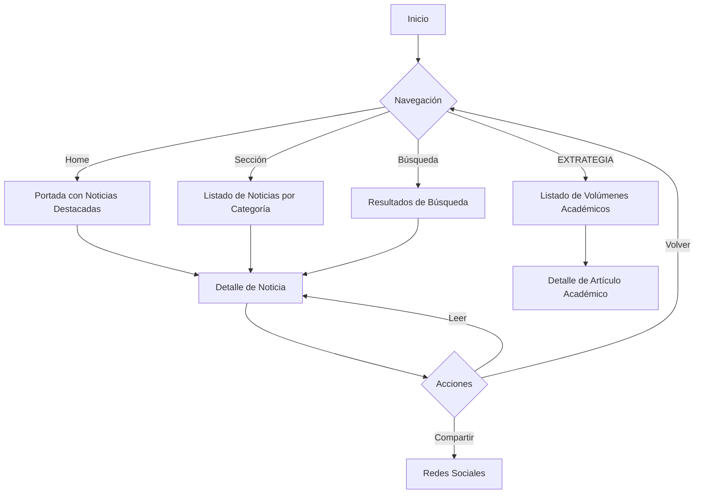
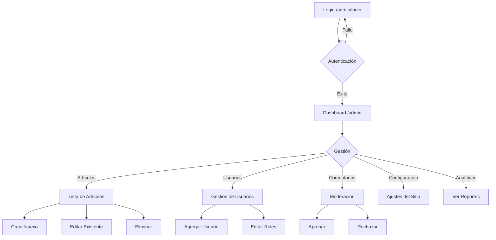

# Conceptualización del Proyecto: PDP Diario Digital

## 1. Análisis Funcional

El proyecto "PDP Diario Digital" es una plataforma web de noticias moderna y dinámica que combina un portal de noticias público con un robusto panel de administración. Su objetivo es informar a la ciudadanía sobre temas políticos, económicos, internacionales y locales, además de ofrecer contenido académico especializado a través de la sección "EXTRATEGIA".

### 1.1. Portal Público
El portal público es la cara visible para los lectores. Sus funciones principales son:
- **Visualización de Noticias**: Presentación de artículos con título, imagen, descripción, contenido completo, autor y fecha.
- **Categorización**: Organización de noticias en secciones (Política, Economía, Internacional, Local, Opinión).
- **Sección Académica (EXTRATEGIA)**: Espacio dedicado a volúmenes y artículos académicos con formato especializado.
- **Búsqueda**: Funcionalidad para buscar noticias por palabras clave.
- **Navegación Intuitiva**: Menú de navegación responsive (escritorio y móvil) y breadcrumbs.
- **Interacción**: Posibilidad de compartir noticias (simulado) y suscribirse al newsletter.

### 1.2. Panel de Administración
El panel de administración permite a los gestores de contenido controlar la plataforma. Sus funciones incluyen:
- **Autenticación**: Sistema de login seguro para administradores, editores y lectores registrados.
- **Dashboard**: Vista general con estadísticas clave (total de artículos, vistas, usuarios, comentarios pendientes).
- **Gestión de Artículos (CRUD)**: Crear, leer, actualizar y eliminar noticias. Incluye editor de contenido y gestión de estado (publicado/borrador).
- **Gestión de Usuarios**: Administración de usuarios y roles (Admin, Editor, Lector).
- **Moderación de Comentarios**: Aprobar, rechazar o eliminar comentarios de los lectores.
- **Configuración del Sitio**: Ajustes generales como nombre del sitio, logos, redes sociales y preferencias de visualización.
- **Analíticas**: Visualización de métricas de rendimiento (vistas por sección, artículos más leídos).
- **Registro de Actividad**: Log de auditoría que registra las acciones realizadas por los usuarios en el panel.

---

## 2. Flujograma Integral

### 2.1. Flujo de Usuario Público


### 2.2. Flujo de Administrador


---

## 3. Documentación Completa

### 3.1. Stack Tecnológico
- **Frontend Framework**: React 18
- **Build Tool**: Vite
- **Lenguaje**: TypeScript
- **Estilos**: Tailwind CSS + Tailwind Merge + CLS
- **Componentes UI**: Radix UI (primitivas accesibles), Lucide React (iconos)
- **Animaciones**: Motion (Framer Motion)
- **Enrutamiento**: React Router DOM v6
- **Gráficos**: Recharts
- **Notificaciones**: Sonner
- **Gestión de Estado**: React Context API
- **Persistencia**: LocalStorage (simulación de backend)

### 3.2. Estructura del Proyecto
```
/
├── src/
│   ├── components/       # Componentes reutilizables
│   │   ├── admin/        # Componentes específicos del admin
│   │   ├── ui/           # Componentes base de UI (botones, inputs, etc.)
│   │   └── ...           # Componentes generales (Header, Footer, NewsCard)
│   ├── contexts/         # Contextos de React (AdminContext)
│   ├── data/             # Datos estáticos y tipos (newsData, adminData)
│   ├── hooks/            # Custom hooks (useArticles)
│   ├── pages/            # Vistas de la aplicación
│   │   ├── admin/        # Vistas del panel de administración
│   │   └── ...           # Vistas públicas
│   ├── styles/           # Archivos CSS globales
│   ├── App.tsx           # Configuración de rutas principal
│   └── main.tsx          # Punto de entrada
├── public/               # Assets estáticos
└── package.json          # Dependencias y scripts
```

---

## 4. Reglamento de Desarrollo

### 4.1. Estándares de Código
- **TypeScript**: Uso estricto de tipos. Evitar `any` siempre que sea posible. Definir interfaces para props y modelos de datos.
- **Componentes**:
  - Functional Components con Hooks.
  - Nombrado en PascalCase (ej. `NewsCard.tsx`).
  - Un componente por archivo (generalmente).
  - Props tipadas explícitamente con `React.FC<Props>`.
- **Estilos**:
  - Uso de clases utilitarias de Tailwind CSS.
  - Para estilos condicionales complejos, usar `cn()` (clsx + tailwind-merge).
  - Variables CSS para colores de marca (`--color-brand-primary`).
- **Estado**:
  - Estado local con `useState` para UI efímera.
  - Context API para estado global (autenticación, datos compartidos).
  - Custom Hooks para lógica reutilizable.

### 4.2. Convenciones de Git (Sugerido)
- Commits semánticos: `feat:`, `fix:`, `docs:`, `style:`, `refactor:`.
- Ramas por funcionalidad: `feature/nombre-feature`, `fix/bug-fix`.

---

## 5. Módulos de Software

### 5.1. Módulo de Autenticación (`AdminContext`)
- **Responsabilidad**: Gestionar el estado de sesión del usuario.
- **Funcionalidades**: Login, Logout, verificación de roles, persistencia de sesión.

### 5.2. Módulo de Contenido (`newsData`, `useArticles`)
- **Responsabilidad**: Gestionar la información de las noticias.
- **Funcionalidades**: Definición de tipos (`NewsArticle`), datos iniciales, recuperación de artículos desde almacenamiento.

### 5.3. Módulo de Administración (`pages/admin/*`)
- **Responsabilidad**: Proveer interfaces para la gestión del sistema.
- **Sub-módulos**:
  - **Dashboard**: Resumen y métricas.
  - **Editor**: Formulario para crear/editar noticias.
  - **Usuarios**: ABM de usuarios.
  - **Moderación**: Flujo de aprobación de comentarios.

### 5.4. Módulo de UI Pública (`pages/*`, `components/*`)
- **Responsabilidad**: Presentación del contenido al usuario final.
- **Sub-módulos**:
  - **Home**: Portada dinámica.
  - **Secciones**: Listados filtrados.
  - **Detalle**: Vista de lectura.
  - **Navegación**: Header, Footer, Menú móvil.

---

## 6. Componentes Internos

### 6.1. Componentes Clave
| Componente | Descripción | Ubicación |
|------------|-------------|-----------|
| `Header` | Barra de navegación principal, responsive, con búsqueda. | `components/Header.tsx` |
| `Footer` | Pie de página con enlaces y copyright. | `components/Footer.tsx` |
| `NewsCard` | Tarjeta para mostrar resumen de noticia. Variantes: standard, featured, compact, horizontal. | `components/NewsCard.tsx` |
| `AdminLayout` | Layout base para el panel de admin (Sidebar + Content). | `components/admin/AdminLayout.tsx` |
| `StatsCard` | Tarjeta de estadísticas para el dashboard. | `components/admin/StatsCard.tsx` |
| `ProtectedRoute` | Wrapper para proteger rutas de admin. | `components/admin/ProtectedRoute.tsx` |

### 6.2. Componentes de UI (Base)
Ubicados en `components/ui/`, basados en Radix UI:
- `Button`, `Input`, `Label`, `Card`, `Dialog`, `DropdownMenu`, `Separator`, `Sheet`, `Table`, `Tabs`, `Textarea`.

---

## 7. Funciones Internas

### 7.1. En `contexts/AdminContext.tsx`
- `login(email, password)`: Valida credenciales contra la lista de usuarios.
- `addArticle(article)`: Crea un nuevo artículo, asigna ID y fecha, actualiza analíticas y log.
- `updateArticle(id, updates)`: Modifica un artículo existente.
- `deleteArticle(id)`: Elimina un artículo y actualiza contadores.
- `addActivityLog(entry)`: Registra una acción en el historial de auditoría.

### 7.2. En `data/newsData.ts`
- `getNewsArticles()`: Recupera artículos de `localStorage` o devuelve los iniciales si no hay datos guardados.
- `initializeNewsData()`: Verifica si hay datos en `localStorage` y si no, carga los datos de ejemplo iniciales.

### 7.3. En `hooks/useArticles.ts` (Inferido)
- `useArticles()`: Hook que probablemente consume el contexto o los datos directos para proveer la lista de artículos a los componentes públicos, reaccionando a cambios.
